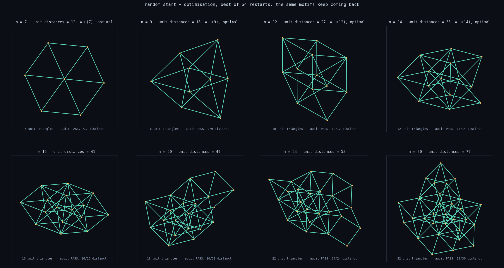
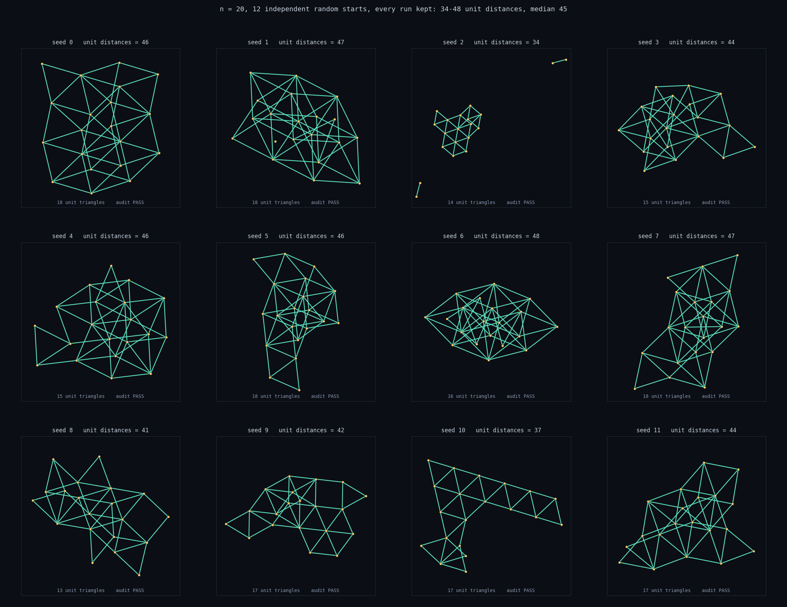

# Erdős unit distance — balls and springs

A numerical attack on the Erdős unit-distance problem: *among `n` points in the
plane, how many pairs can be at distance exactly 1?*

The model is a **complete graph of springs, every one with rest length 1**. All
`n(n-1)/2` pairs pull or push toward unit separation at once, which is wildly
over-constrained — the assembly is frustrated and cannot satisfy everything.
Relax it, anneal, and count the springs that ended up within `ε` of unit length.
Those are the edges of a unit-distance graph.

The counts are not really the point. The thing this repository does that a
construction cannot is **generate inspirations on demand** — ask it for `n`
points and it hands back a structure nobody designed, which you can then read,
name, and generalise by hand. [Jump to that](#what-it-is-actually-for-inspirations-on-demand).

```bash
pip install -r requirements.txt

python run.py --n 24                       # live 2D view
python run.py --n 40 --headless --trials 24
python run.py --benchmark                  # score against the known optima
```


Every segment above is exactly length 1, to about 2e-16.

## The result that matters

For `n ≤ 14` the true maximum `u(n)` is known by exhaustive search. The solver
reaches it in **every one of those cases** (24 restarts each, the default):

| n | 4 | 5 | 6 | 7 | 8 | 9 | 10 | 11 | 12 | 13 | 14 |
|---|---|---|---|---|---|---|----|----|----|----|----|
| known `u(n)` | 5 | 7 | 9 | 12 | 14 | 18 | 20 | 23 | 27 | 30 | 33 |
| found | 5 | 7 | 9 | 12 | 14 | 18 | 20 | 23 | 27 | 30 | 33 |

It also never *exceeds* them, which is the more important check — any value
above `u(n)` would mean the counting is lying rather than the search winning.

**Counts are audited, not trusted.** The cheapest way to fake a high score is to
stop using `n` distinct points: stack 12 balls on 3 spots a unit apart and every
cross-cluster pair "is" a unit distance, scoring 48 against a true optimum of
27. The optimiser finds that immediately if you let it. So every configuration
is re-checked from its coordinates alone, by code that has no idea how it was
produced, and a restart that fails the audit always loses to one that passes.
[Details](./docs/method.md#counts-are-audited-not-trusted).

## How a run works


Two halves, because the relaxation is good at combinatorics and bad at
precision — it will happily park a spring at 1.0004.

1. **Anneal** the complete spring graph under damped molecular dynamics,
   narrowing the range `σ` over which a spring stays stiff. This decides *which*
   pairs want to be unit.
2. **Project**: freeze that edge set and solve the geometry exactly with
   Levenberg–Marquardt, driving residuals to ~1e-15, then try to grow it.

Then **reheat** and repeat. That basin hopping is where most of the quality
comes from — extra annealing steps stop paying off around 2500, because what
limits a run is which basin it fell into, not how carefully it descended.

Getting this to work at all needed three non-obvious fixes, each found by
results coming out wrong: saturating springs so far pairs cannot dominate, a
well depth independent of `σ` so the objective does not evaporate as it anneals,
and a hard core stiff enough to survive both.
[The method in full](./docs/method.md).

## How good is it?

Excellent for small `n`, and it runs out of steam quickly.

| n | triangular | Erdős grid | Eisenstein grid | prism | this solver |
|---|---|---|---|---|---|
| 20 | 44 | 37 | 44 | 40 | **49** |
| 30 | 69 | 66 | 79 | 78 | **79** |
| 50 | 123 | 130 | **167** | 135 | 124 |
| 80 | 207 | 222 | **311** | 247 | 171 |

The solver wins at `n = 20`, only ties the best construction at `n = 30`, and is
well behind by `n = 50`. Past that range the analytic families win outright and
random restarts stop finding anything better, because the search space grows far
faster than the restart count. Seeding from a construction and letting it
improve locally is the useful move there:

```bash
python run.py --n 30 --headless --init prism --jitter 0.10 --trials 24
```

(Solver figures use 64 restarts at `n = 20` and `30`, 24 at `n = 50` and 4 at
`n = 80`, so the last two are lower bounds on what it would find given more
compute, not ceilings. The 49 at `n = 20` is exact to 2e-16 per edge, with the
next-closest pair 0.19 away from unit — no tolerance call is involved.)

## What it is actually for: inspirations on demand

This is the part of the repository worth taking. Read the table above and the
solver looks like a losing proposition — it is behind the constructions by
`n = 50` and hopeless by `n = 80`. But the counts were never the product. What
this does that no construction can is **produce candidate structures nobody
designed, at whatever `n` you ask for, in under a minute**.



Nothing above was seeded. Every panel starts as uniform random points and is
only ever pushed downhill on spring energy — the solver has no notion of a
lattice, a hexagon or a rhombus anywhere in it. Four of the eight land on the
proven optimum.

Ask again with different seeds and the same shapes keep coming back:



Twelve independent single runs at `n = 20`, none discarded, good and bad alike
— 34 to 48 unit distances.

**By eye — and it is only by eye, there is no motif detector in this code — the
runs converge on a short list of popular patterns:**

- **the centered hexagon**, a hub plus six unit vectors. That *is* the `n = 7`
  panel, found from random points, and it is the block the flower sums are
  built from.
- **rhombi glued along a unit short diagonal** — the most common local unit in
  every large panel, and the reason the rhombic lattice outscores the square.
- **strips of unit triangles**, clearest at seed 10: the prism, arrived at from
  below.
- **triangulated patches that are lattice-like but mutually rotated**, meeting
  along a seam instead of forming one clean grain. The big panels look closer to
  polycrystalline than to a single lattice fragment. Whether that is a property
  of the optima or a limitation of the search is open — worth knowing before you
  generalise from one.

Several of the constructions in the next section were reached this way, by
reading pictures like these and generalising what was in them. The loop is: run
the optimiser where it is strong (`n ≲ 30`), name the motif by eye, generalise
it analytically — tile it, Minkowski-sum it, rescale it — then verify the closed
form numerically and audit it for coincident points.
[The workflow in full](./docs/constructions.md#the-lattices-are-not-assumed-they-emerge).

Naming the motif is human inspection, and there is currently no substitute for
it here: the solver finds structures far more readily than it explains them.
Not everything came from this route — the Eisenstein grid fell out of the
arithmetic of Loeschian numbers, not out of a picture — but the geometric
families did.

It also fails legibly, which matters when you are mining pictures for ideas.
Seed 2 stranded two points as detached unit-distance pairs and scored 34; that
is visible at a glance, and a failure you can see is worth more than a number
you cannot check.

```bash
python scripts/random_gallery.py            # regenerate both figures
python scripts/random_gallery.py --quick    # fewer restarts, for a smoke test
```

Configurations are written to `results/random_gallery/` so a panel that catches
your eye can be re-examined without re-running the search.

## Constructions


Nearly every construction here is a small point set `B` copied onto every site
of a unit lattice, and its density has a closed form:

```
edges / n  ->  z/2 + u(B) / |B|
```

That single law orders the whole family — the prism of unit triangles at `4n`,
each up/down doubling adding `0.5`, centered hexagons at `4.71n` — and it says
what to feed it: not another lattice, but the densest small unit-distance set
you have. **A fixed basis only ever moves the constant**; escaping `Θ(n)`
requires the basis to grow with `n`, which is what the rotated flower sums do at
`Θ(n log n)`.

Separately, Erdős' rescaling trick — find the most popular pairwise distance and
scale it to 1 — turns out to do nothing for flower sums and a great deal for the
triangular lattice, where it beats Erdős' own square-grid version at every size.


That is the strongest construction here, and it is just the triangular lattice
with the scale chosen so its fattest distance shell becomes the unit. The points
never move; only which pairs count changes.

[All of it, with the arithmetic](./docs/constructions.md) ·
[growth rates and bounds](./docs/growth.md)

## Documents

| | |
|---|---|
| [method.md](./docs/method.md) | how the solver works, why the naive version fails, auditing, the live view |
| [constructions.md](./docs/constructions.md) | the `B ⊕ lattice` law, the prism, flower sums, the rescaling trick, and why these motifs emerge from the solver unaided |
| [growth.md](./docs/growth.md) | big-O for every family, the standing bounds, measured slopes, runtime cost |

## Layout

| file | what it holds |
|---|---|
| `springs.py` | the four spring laws and the failure threshold |
| `energy.py` | total energy and analytic gradient, blocked over pairs |
| `sim.py` | annealing schedule, integrators, detached-ball rescue |
| `polish.py` | Levenberg–Marquardt projection onto exact unit distances |
| `counting.py` | promoting springs to edges, and the overlap audit |
| `solver.py` | the anneal → project → reheat pipeline and restarts |
| `init.py` | starting configurations, `B ⊕ lattice`, the rescaling trick |
| `known.py` | proven optima, baselines, the `r-min` default |
| `render.py` | live 2D view and static PNG output |
| `cli.py` | argument parsing and the three run modes |

`scripts/` holds the figure generator, `random_gallery.py` (the inspiration
run above), and four exploration scripts: `explore_hex.py`, `explore_prism.py`,
`explore_rescale.py` and `asymptotics.py`.

Available starts: `random`, `triangular`, `square`, `erdos_grid`,
`eisenstein_grid`, `hex_flower`, `hex_minkowski`, `prism`, `prism_double`,
`hex_lattice`, `moser`, `circle`.

The solver needs only **numpy**; matplotlib is used for the view and PNGs.
Gradients are analytic and finite-difference tested for every law, with and
without failure and core repulsion active. `pytest tests -q` runs 158 tests.

## Caveats

- `u(n)` for `n ≤ 14` is quoted from the literature (Schade, 1993); cross-check
  against OEIS A186705 before relying on it. Nothing else in the code depends on
  those numbers — they are only used for scoring.
- The density law assumes the basis sits at a generic rotation to the lattice.
  Special angles can do better *or* collapse into duplicate points; `--init`
  uses tested generic values, and the audit catches the rest.
- The projection is a dense `2n × 2n` solve below `--n 250` and matrix-free
  conjugate gradients above it. Both paths are tested to agree; the CG path is
  the one to watch if large runs look wrong.
- Energy and gradient are `O(n²)` per step by construction — it is a complete
  graph. Blocking bounds the memory, not the work.
- The audit's notion of "distinct" is a tolerance (`1e-6`), not exact
  inequality, which is the conservative choice.
