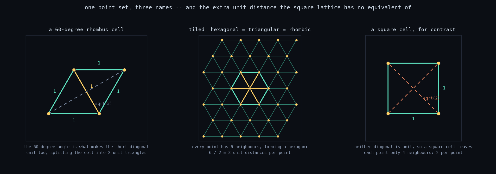
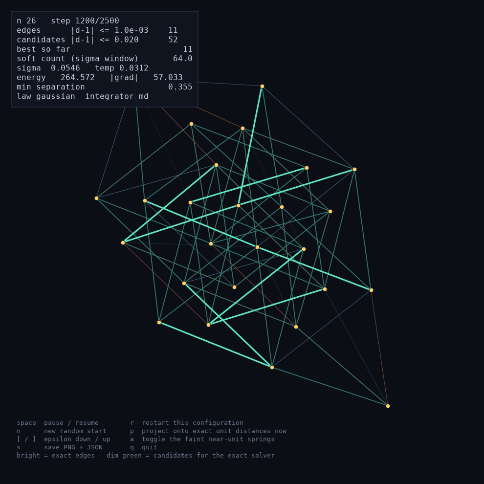

# Erdős unit distance — balls and springs

A numerical attack on the Erdős unit-distance problem: *among `n` points in the
plane, how many pairs can be at distance exactly 1?*

The model is a **complete graph of springs, every one with rest length 1**.
All `n(n-1)/2` pairs pull or push toward unit separation at once, which is
wildly over-constrained — the assembly is frustrated and cannot satisfy
everything. Relax it, anneal, and count how many springs ended up within `ε` of
unit length. Those are the edges of a unit-distance graph.

```bash
pip install -r requirements.txt

python run.py --n 24                       # live 2D view
python run.py --n 40 --headless --trials 24
python run.py --benchmark                  # score against the known optima
```


Every segment in those pictures is exactly length 1, to about 2e-16.

## The result that matters

For `n ≤ 14` the true maximum `u(n)` is known by exhaustive search. The solver
reaches it in **every one of those cases** (24 restarts each, the default):

| n | 4 | 5 | 6 | 7 | 8 | 9 | 10 | 11 | 12 | 13 | 14 |
|---|---|---|---|---|---|---|----|----|----|----|----|
| known `u(n)` | 5 | 7 | 9 | 12 | 14 | 18 | 20 | 23 | 27 | 30 | 33 |
| found | 5 | 7 | 9 | 12 | 14 | 18 | 20 | 23 | 27 | 30 | 33 |

It also never *exceeds* them, which is the more important check — any value
above `u(n)` would mean the counting is lying rather than the search is winning.
`run.py --benchmark` reproduces the table and refuses to score a run as optimal
if its audit fails.

## Counts are audited, not trusted

The cheapest way to fake a high score is to stop using `n` distinct points.
Stack 12 balls onto 3 spots a unit apart and every cross-cluster pair "is" a
unit distance: 48 of them, against a true optimum of 27. It is not a point set
at all, but nothing in the energy forbids it, and **the optimiser finds it
immediately** if you let it.

So every reported configuration is re-checked from its coordinates alone, by
code that has no idea how it was produced:

```
audit FAIL: 48 unit distances among 3/12 distinct points, min separation 0
  - 9 ball(s) coincide within 1e-06; the count is inflated by duplicate points
  - count drops from 48 to 3 once coincident balls are merged
```

The audit verifies that no two balls coincide, that merging any coincident ones
would not change the count, that recounting the coordinates reproduces the
claimed edge list, and that every claimed edge really is within `ε` of unit
length and listed once. `--headless` prints it, the benchmark refuses to pass
without it, the live HUD warns on screen, and `SolveResult.valid` carries it.
A restart whose audit fails always loses to one whose audit passes, no matter
how many "edges" it claims.

Three defences keep it passing in the first place: a hard core during the
relaxation, stiffness-scaled so it cannot be overwhelmed as the well narrows;
the same core as a barrier inside the exact solver, which otherwise happily
drives points into exact coincidence; and `--r-min` defaulting to a value
derived from the best construction known at that `n`, so it never excludes a
real answer.

## Why a plain spring graph does not work

Two more things had to be right, both found by the numbers coming out wrong.

**Far springs must let go.** With ordinary Hooke springs a pair at distance 5
pulls five times harder than a pair at 1.2, so far pairs dominate the gradient
and crush everything into a blob. Every spring law here except `hooke`
*saturates*: past a strain scale `σ` the force dies away and the spring
effectively detaches. Annealing `σ` from wide to narrow interpolates from a true
complete Hooke graph down to a network where only near-unit springs still pull.

**The well depth must not depend on `σ`.** The obvious normalisation — fix the
small-strain stiffness, let the energy saturate at `k σ²` — makes the whole
objective *evaporate* as `σ` anneals to zero, and the assembly diffuses apart
exactly when it should be locking in. Instead the depth is fixed at one unit of
reward per satisfied spring, so

```
energy = depth × (number of springs not satisfied)
```

and minimising it *is* maximising the unit-distance count. The stiffness
`depth/σ²` then grows by orders of magnitude during the anneal, which the MD
integrator absorbs by scaling its timestep with `σ` and its damping with `1/σ`
— the dynamics stay self-similar and simply tighten.

## How a run works


Each round has two halves, because the relaxation is good at combinatorics and
bad at precision — it will happily park a spring at 1.0004.

1. **Anneal** the complete spring graph under damped molecular dynamics with
   Langevin kicks, narrowing `σ`. This decides *which* pairs want to be unit.
2. **Project**: freeze that edge set and solve the geometry exactly with
   Levenberg–Marquardt, driving residuals to ~1e-15. Then look for near-misses
   the tightened geometry pulled into range, add them, and re-solve.

The drop in that last panel is the point of step 2. Springs "within 0.02 of
unit" are wishful thinking — many of them cannot all be satisfied at once, and
the exact solve prunes the ones that were never realisable. What survives is
geometry, not rounding.

Then **reheat** — restart the anneal from the exact configuration with a smaller
`σ0` — and repeat. This basin hopping is where most of the quality comes from:
sweeps showed extra annealing steps stop paying off past ~2500, because what
limits a run is which basin it fell into, not how carefully it descended.

## Spring failure (optional, off by default)

Independently of the smooth saturation, a spring can be made to simply **snap**:

```bash
python run.py --n 24 --break-lo 0.5 --break-hi 2.0    # squeezed or stretched too far
python run.py --n 24                                  # the default: no failure
```

Squeezed below `break-lo` or stretched past `break-hi`, a spring exerts exactly
zero force. Its energy plateaus at the value it had when it broke, so there is
no force step and no spurious well at the threshold for balls to get caught in.
It composes with the smooth laws and is what makes `--law hooke` usable at all.

It is **off by default**, because the saturating laws already fade a violated
spring out smoothly and the hard cutoff is a second, blunter mechanism on top.
It is not free to leave off, though: with failure at 0.5/2.0 the solver reaches
`u(7) = 12` from ten restarts, and without it `n = 7` needs about 24 restarts to
find the same configuration. Every other `n ≤ 14` is unaffected.

The core repulsion is deliberately *not* subject to failure — it is all that
stops two balls that have snapped every spring between them from merging.

**Stranded balls.** Either way, a ball can end up with nothing close enough to
pull on it: past `break-hi` if failure is on, or simply past a few `σ` of strain
if it is off, where the saturating force is numerically zero. Such a ball is
inert and wastes a point. Every `--rescue-every` steps those get put back into
the assembly, worth a lot at moderate `n` (at `n = 24`, 48 → 57 unit distances).
The reach that defines "stranded" is pinned to `σ0` rather than the current `σ`;
letting it shrink with the anneal makes it approach 1, at which point the rescue
starts relocating balls that are still doing useful work.

## Constructions: one law covers all of them

Every construction below is a small point set `B` copied onto every
site of a unit lattice — a Minkowski sum `B ⊕ lattice`. Counting the edges per
site gives `z/2 · |B|` inside each basis point's own lattice copy, plus one edge
for every unit pair *within* `B`. So the density has a closed form:

```
edges / n  ->  z/2 + u(B) / |B|
```

Both terms are levers.

**The base lattice sets the constant**, and it is worth being explicit about
which lattice that is, because it goes by three names.



Take two unit vectors 60° apart and tile the plane with the cell they span.
That cell is a **rhombus** with four unit sides. Its long diagonal is √3, but
its *short* diagonal — the one joining the two 60° corners — is also exactly 1,
because those three points form an equilateral triangle. So the short diagonal
cuts the rhombus into two unit **triangles**, which is why the same point set is
called the triangular lattice. And every point ends up with six neighbours at
distance 1, arranged in a **hexagon**, which is why it is also called the
hexagonal lattice. One point set, three names, depending on whether you look at
the cell, the pieces it cuts into, or the neighbourhood of a point.

Counting edges per point from any of those views agrees: six neighbours shared
between two points each gives `6/2 = 3`. From the cell view, each rhombus
contributes two of its four sides (the other two belong to neighbouring cells)
plus its short diagonal, which belongs to no one else — again 3.

A square cell has the same two-sides-per-cell, but *neither* diagonal is unit
(both are √2), so there is nothing to add: `4/2 = 2`. Hence the rhombic lattice
carries exactly **one more unit distance per point**, and that gap of 1.00n
persists across every basis, which is the two rows of the figure below.

One naming trap: "hexagonal lattice" here means this triangular point set, not
the *honeycomb* (graphene) pattern where each point has only three neighbours.
The honeycomb is not a lattice at all — it is this lattice with a two-point
basis — and it is much worse, at 1.33n.

**The basis sets the rest**, and says what to feed it: not another lattice, but
the densest small unit-distance set you have.

| basis `B` | `\|B\|` | `u(B)` | on rhombic | on square | what it is |
|---|---|---|---|---|---|
| one point | 1 | 0 | 3n | 2n | the plain lattice |
| unit segment | 2 | 1 | 3.5n | 2.5n | two sheets joined by unit rungs |
| unit triangle | 3 | 3 | **4n** | 3n | the prism, stacked and tiled |
| two triangles a unit apart | 6 | 9 | **4.5n** | 3.5n | the prism doubled |
| centered hexagon | 7 | 12 | **4.71n** | 3.71n | wheel `W₆` on every site |
| flower sum, k=2 | 49 | 168 | **6.43n** | 5.43n | see below |


Every entry is verified numerically and audited for overlapping points; the
measured densities sit just below their limits because a finite patch has a
boundary. `scripts/explore_prism.py` reproduces the table.

**The prism.** Triangle ABC joined to DEF with A–D, B–E, C–F all unit. In the
plane that *forces* DEF to be a translate of ABC by a unit vector — there is no
other realisation — so tiling means translating by two unit vectors `v` and `w`.
Setting the angle between them to exactly 60° makes `v − w` a unit vector too,
which connects the diagonal neighbours as well and lifts the count from 3n to

```
3[ab + (a-1)b + a(b-1) + (a-1)(b-1)]  ->  4n
```

verified exactly. The triangle's rotation relative to `v` and `w` changes
nothing about the count, so the default picks a rotation with comfortable point
separation (0.52) rather than one that merely avoids collisions.

**Doubling up and down** adds a `{0, u}` factor to the basis, which adds exactly
one unit pair per two basis points: **+0.5 density per doubling**, measured at
3.75 → 4.25 → 4.75 → 5.25n for zero through three doublings.

**A prism of triangular lattices** — two lattice sheets joined by unit rungs —
is the `|B| = 2` row, and is therefore *worse* than the prism of triangles. A
segment carries only half a unit distance per point; a triangle carries one.
The lattice you stack is the *base*, not the basis; stacking lattices on
lattices adds nothing that raising `u(B)/|B|` would not add more of.

**The centered hexagon** (a hub plus six unit vectors, the wheel `W₆`) has 12
unit distances on 7 points, which is exactly `u(7)`, and it is the first thing
the solver rediscovers. Note that *tiling* it gives nothing new — its six
vectors generate the triangular lattice, so a honeycomb of centered hexagons
**is** the triangular lattice. The true honeycomb (graphene, 3 neighbours each)
is far worse, at 1.33n.

**Flower sums.** What does work on the hexagon is Minkowski-summing **rotated**
copies of it. Summing `k` flowers at generic angles gives `7^k` distinct points
carrying exactly `12·k·7^(k-1)` unit distances — that is `(12/7)·log₇(n)·n`, so
it grows like `n log n`. Verified exactly for `k = 1..4`, up to 2401 points and
16464 unit distances, all passing the audit. Since `u(B)/|B|` for a flower sum
itself grows logarithmically, feeding one in as the lattice basis inherits that
growth.

Available as `--init prism`, `prism_double`, `hex_lattice`, `hex_minkowski`;
`init.lattice_product(n, basis, lattice=...)` builds any other combination,
and `init.density_limit(basis, lattice)` predicts what it will score.

## Growth rates

The density table above compares *constants*. In complexity terms almost all
of those constructions are the same thing, and it is worth being precise about
where the real dividing line falls.

| construction | count | class |
|---|---|---|
| square lattice | 2n − Θ(√n) | Θ(n) |
| triangular lattice | 3n − Θ(√n) | Θ(n) |
| prism of triangles | 4n − Θ(√n) | Θ(n) |
| prism doubled k times, k fixed | (4 + k/2)n − Θ(√n) | Θ(n) |
| centered hexagon × lattice | (3 + 12/7)n − Θ(√n) | Θ(n) |
| rotated flower sums | (12/7)·n·log₇n | Θ(n log n) |
| Erdős rescaled grid | n^(1+c/log log n) | superpolylogarithmic |
| best known upper bound | O(n^(4/3)) | Spencer–Szemerédi–Trotter, 1984 |

**A fixed basis can only ever move the constant.** The density law
`z/2 + u(B)/|B|` is a fixed number whenever `B` is a fixed set, so every
`B ⊕ lattice` construction is `Θ(n)` no matter how clever `B` is. The `−Θ(√n)`
is the boundary: a compact patch of n lattice points has `Θ(√n)` points on its
edge, each missing some neighbours, which is why measured densities always
approach their limits from below and never reach them.

To leave `Θ(n)` the basis has to **grow with n**. That is exactly what the
flower sums do — `k` rotated factors give `7^k` points, so `|B|` and `n` grow
together and the density becomes `(12/7)·log₇n` instead of a constant.

The doubling trick is the same story in disguise: one doubling adds 0.5 to a
constant, but iterating it gives a basis of size `3·2^k` with density `4 + k/2`,
which is again logarithmic in n. The lever was never the constant — it is
whether the basis is allowed to grow.

`scripts/asymptotics.py` measures the local log-log slope
`d log(edges) / d log(n)` for each family and reproduces the table:

```
local log-log slope               100      250      600     1500     3000
square lattice                    ---    1.048    1.030    1.019    1.012
triangular lattice                ---    1.066    1.032    1.021    1.013
prism: triangle x lattice         ---    1.116    1.066    1.039    1.028
prism doubled up+down             ---    1.146    1.090    1.056    1.034
centered hexagon x lattice        ---    1.138    1.091    1.061    1.039
Erdos rescaled grid               ---    1.305    1.318    1.203    1.305
```

Every lattice family converges to 1. The grid holds ~1.30 without decaying.
Flower sums, measured at their natural sizes `n = 7^k`, give slopes
1.356, 1.208, 1.148, 1.115 — decaying toward 1 exactly as `1 + 1/ln n` predicts
for `n log n`, and matching `12k·7^(k-1)` exactly at every k.

One caveat on reading those slopes: `Θ(n log n)` only ever shows up as a slope
of about `1 + 1/ln n`, which at any size you can actually build is barely
distinguishable from 1. Density is the more honest readout at these scales;
the slope only separates the classes once the grid pulls away.

**The asymptotically better construction loses at every size you can build.**
Flower sums beat the Erdős grid at n = 49 (168 vs 120) and n = 343
(1764 vs 1426). The grid only overtakes by n = 2401 (16760 vs 16464), and by
n = 16807 it leads 187639 to 144060. The `n log n` construction wins in
practice; the `n^(1+c/log log n)` one wins in theory.

### Cost of running it

Separately from what the constructions achieve, what the code costs:

| step | complexity |
|---|---|
| energy + gradient | Θ(n²) per step — it is a complete graph, so this is inherent |
| edge counting and audit | Θ(n²) |
| LM projection, dense path | Θ(n³) per iteration (n ≤ 250) |
| LM projection, matrix-free | Θ(m) per CG step, m = edges (n > 250) |
| a full search | Θ(trials · cycles · steps · n²) |

Row blocking bounds the *memory* of the pair loops, not the work.

## How good is the solver, really?

Honestly: excellent for small `n`, and it runs out of steam as `n` grows.

| n | triangular | integer grid | prism | this solver |
|---|---|---|---|---|
| 20 | 44 | 37 | 40 | **48** |
| 30 | 69 | 66 | 78 | **79** |

Up to about `n = 30` the springs beat every construction here — though note how
close the prism gets at `n = 30` (78 against 79), having been well behind at
`n = 20`. That crossover is the story: past this range the analytic
constructions win outright and random restarts stop finding anything better,
because the search space grows far faster than the restart count. Seeding the
relaxation from a construction and letting it improve locally is the useful move
there, and it does sometimes pay (at `n = 27`, a prism seed of 63 relaxes to
65):

```bash
python run.py --n 30 --headless --init prism --jitter 0.10 --trials 12
```

Available starts: `random`, `triangular`, `square`, `erdos_grid`, `hex_flower`,
`hex_minkowski`, `prism`, `prism_double`, `hex_lattice`, `moser`, `circle`.

## The live view



<kbd>space</kbd> pause · <kbd>r</kbd> restart · <kbd>n</kbd> new start ·
<kbd>p</kbd> project onto exact unit distances · <kbd>[</kbd> <kbd>]</kbd> change `ε` ·
<kbd>a</kbd> toggle faint springs · <kbd>s</kbd> save PNG + JSON · <kbd>q</kbd> quit

Three layers are drawn. Faint warm/cool lines are springs still negotiating —
warm where compressed, cool where stretched. Dim green are *candidates*: what
the relaxation has agreed on and will hand to the exact solver. Bright green are
the springs within `ε` of unit, the ones actually counted. Watching the faint
set condense into the bright set as `σ` anneals is the method in one picture.

Balls transiently overlapping mid-anneal is normal — the core pushes them back
apart as it converges, and the HUD warns on screen if any are still coincident
at the end.

## Layout

| file | what it holds |
|---|---|
| `springs.py` | the four spring laws and the failure threshold |
| `energy.py` | total energy and analytic gradient, blocked over pairs |
| `sim.py` | annealing schedule, integrators, detached-ball rescue |
| `polish.py` | Levenberg–Marquardt projection onto exact unit distances |
| `counting.py` | promoting springs to edges, and the overlap audit |
| `solver.py` | the anneal → project → reheat pipeline and restarts |
| `init.py` | starting configurations and the `B ⊕ lattice` constructions |
| `known.py` | proven optima, baselines, the `r-min` default |
| `render.py` | live 2D view and static PNG output |
| `cli.py` | argument parsing and the three run modes |

`scripts/` holds the figure generator plus three exploration scripts:
`explore_hex.py` (honeycomb-family constructions), `explore_prism.py` (the
stacked-triangle pattern and the density law), and `asymptotics.py` (measured
growth rates against the closed forms).

The solver needs only **numpy**; matplotlib is used for the view and PNGs.
Gradients are analytic and finite-difference tested for every law, with and
without failure and core repulsion active. `pytest tests -q` runs 150 tests.

## Caveats

- `u(n)` for `n ≤ 14` is quoted from the literature (Schade, 1993); cross-check
  against OEIS A186705 before relying on it. Nothing else in the code depends on
  those numbers — they are only used for scoring.
- The density law `3 + u(B)/|B|` assumes the basis sits at a generic rotation to
  the lattice, so that a pair of basis points is a unit apart in exactly one
  lattice translate. Special angles can do better *or* collapse into duplicate
  points; `--init` uses tested generic values, and the audit catches the rest.
- The projection forms a dense `2n × 2n` system below `--n 250` and switches to
  a matrix-free conjugate-gradient solve above it. Both paths are tested to
  agree; the CG path is the one to watch if large runs look wrong.
- Energy and gradient are `O(n²)` per step by construction — it is a complete
  graph. Blocking bounds the memory, not the work.
- The audit's notion of "distinct" is a tolerance (`1e-6`), not exact
  inequality. Points closer than that are treated as the same point, which is
  the conservative choice.
