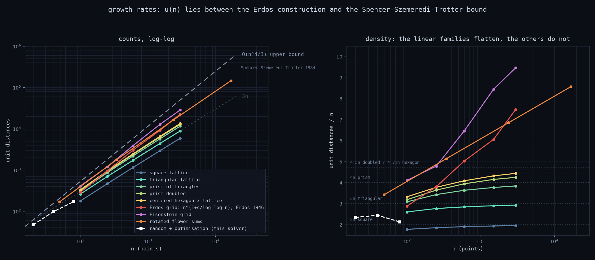

# Growth rates and complexity

*Part of the [Erdős unit distance](../README.md) project.*

The density table above compares *constants*. In complexity terms almost all
of those constructions are the same thing, and it is worth being precise about
where the real dividing line falls.

| construction | count | class |
|---|---|---|
| square lattice | 2n − Θ(√n) | Θ(n) |
| triangular lattice | 3n − Θ(√n) | Θ(n) |
| prism of triangles | 4n − Θ(√n) | Θ(n) |
| prism doubled k times, k fixed | (4 + k/2)n − Θ(√n) | Θ(n) |
| centered hexagon × lattice | (3 + 12/7)n − Θ(√n) | Θ(n) |
| rotated flower sums | (12/7)·n·log₇n | Θ(n log n) |
| Erdős rescaled grid (square) | n^(1+c/log log n) | superpolylogarithmic |
| Eisenstein grid (triangular) | n^(1+c/log log n), larger c | superpolylogarithmic |
| best known upper bound | O(n^(4/3)) | Spencer–Szemerédi–Trotter, 1984 |

The last three rows are the standing bounds on `u(n)` itself rather than
constructions of this project's own: Erdős (1946) gives the lower bound — the
Eisenstein grid is the same argument run over `i² + ij + j²` instead of
`i² + j²` — and Spencer–Szemerédi–Trotter (1984) the upper. No one has closed
the gap since.

The solver itself is not in that table because it is a *search*, not a family
with a closed form. It appears on the plot below as a dashed line, and it stops
at `n = 80` for the honest reason that each point costs a full multi-restart
search.

**A fixed basis can only ever move the constant.** The density law
`z/2 + u(B)/|B|` is a fixed number whenever `B` is a fixed set, so every
`B ⊕ lattice` construction is `Θ(n)` no matter how clever `B` is. The `−Θ(√n)`
is the boundary: a compact patch of n lattice points has `Θ(√n)` points on its
edge, each missing some neighbours, which is why measured densities always
approach their limits from below and never reach them.

To leave `Θ(n)` the basis has to **grow with n**. That is exactly what the
flower sums do — `k` rotated factors give `7^k` points, so `|B|` and `n` grow
together and the density becomes `(12/7)·log₇n` instead of a constant.

The doubling trick is the same story in disguise: one doubling adds 0.5 to a
constant, but iterating it gives a basis of size `3·2^k` with density `4 + k/2`,
which is again logarithmic in n. The lever was never the constant — it is
whether the basis is allowed to grow.



The left panel is the whole problem in one picture: everything buildable sits
in the band between Erdős's construction and the Spencer–Szemerédi–Trotter
ceiling, and closing that gap is the open question. The `O(n^(4/3))` line is
drawn for *shape* only — its constant is not determined, so it is positioned as
an envelope above the data rather than as a prediction.

The white dashed line is the solver itself: random start plus optimisation, no
construction assumed. It is competitive at the left edge and stops at `n = 80`
because each of its points is a full multi-restart search, not a formula. That
early stop is the real limitation of the approach, and it is why the analytic
families exist at all.

The right panel is the more honest readout at these sizes. Density flattens for
every fixed-basis family, each converging to its own `z/2 + u(B)/|B|`, while the
two rescaled grids and the flower sums keep climbing. It also shows the
crossover: flower sums lead until about n = 2400, where the grids pass them.

`scripts/asymptotics.py` measures the local log-log slope
`d log(edges) / d log(n)` for each family and reproduces the table:

```
local log-log slope               100      250      600     1500     3000
square lattice                    ---    1.048    1.030    1.019    1.012
triangular lattice                ---    1.066    1.032    1.021    1.013
prism: triangle x lattice         ---    1.116    1.066    1.039    1.028
prism doubled up+down             ---    1.146    1.090    1.056    1.034
centered hexagon x lattice        ---    1.138    1.091    1.061    1.039
Erdos rescaled grid               ---    1.305    1.318    1.203    1.305
Eisenstein grid                   ---    1.167    1.343    1.292    1.165
```

Every lattice family converges to 1. Both rescaled grids stay well above it
without decaying — the Erdős grid around 1.30, the Eisenstein grid bouncing
between 1.17 and 1.34. Those two wander because the divisor spike they ride is
number-theoretic: how good a size is depends on how many representations its
popular norm happens to have, which is not smooth in `n`.
Flower sums, measured at their natural sizes `n = 7^k`, give slopes
1.356, 1.208, 1.148, 1.115 — decaying toward 1 exactly as `1 + 1/ln n` predicts
for `n log n`, and matching `12k·7^(k-1)` exactly at every k.

One caveat on reading those slopes: `Θ(n log n)` only ever shows up as a slope
of about `1 + 1/ln n`, which at any size you can actually build is barely
distinguishable from 1. Density is the more honest readout at these scales;
the slope only separates the classes once the grid pulls away.

**The asymptotically better construction loses at every size you can build.**
Flower sums beat the Erdős grid at n = 49 (168 vs 120) and n = 343
(1764 vs 1426). The grid only overtakes by n = 2401 (16760 vs 16464), and by
n = 16807 it leads 187639 to 144060. The `n log n` construction wins in
practice; the `n^(1+c/log log n)` one wins in theory.

### Cost of running it

Separately from what the constructions achieve, what the code costs:

| step | complexity |
|---|---|
| energy + gradient | Θ(n²) per step — it is a complete graph, so this is inherent |
| edge counting and audit | Θ(n²) |
| LM projection, dense path | Θ(n³) per iteration (n ≤ 250) |
| LM projection, matrix-free | Θ(m) per CG step, m = edges (n > 250) |
| a full search | Θ(trials · cycles · steps · n²) |

Row blocking bounds the *memory* of the pair loops, not the work.
